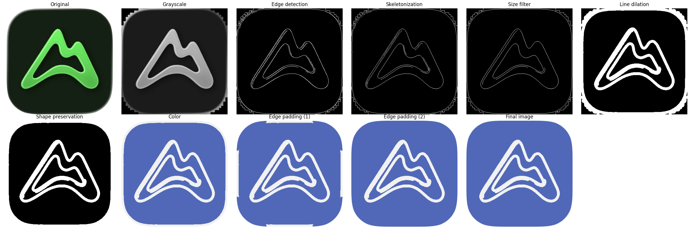

# Icon Themeify

This tool serves for procedurally generating themed icons from original app icon images. The main use case revolves around generating icons for consistently themed app pages for iOS, iPadOS and macOS devices, for aesthetics purposes. While commonly used icons are available on various platforms, less widely used apps do not have such themed icons available, resulting in the need to create them in an automated manner.

## Showcase using `AllTrails`

  <!-- First image with its own title -->
  

    
<strong>Original Icon</strong>

    
  

  <!-- Shared title for the next three images -->
  

    
<strong>Themed Icons</strong>

    

      
      
      
    

  

 

 

### Process

  

## Setup

Download the tool as common practice using pip or consider cloning the repository to make use of the base configuration files and examples.

## Usage

1. Download the original source image of the app icon, e.g. here for [AllTrails](https://apps.apple.com/us/app/alltrails-hike-bike-run/id405075943)
2. Run the CLI using `python cli.py -i <input-path> -o <output-path>`

